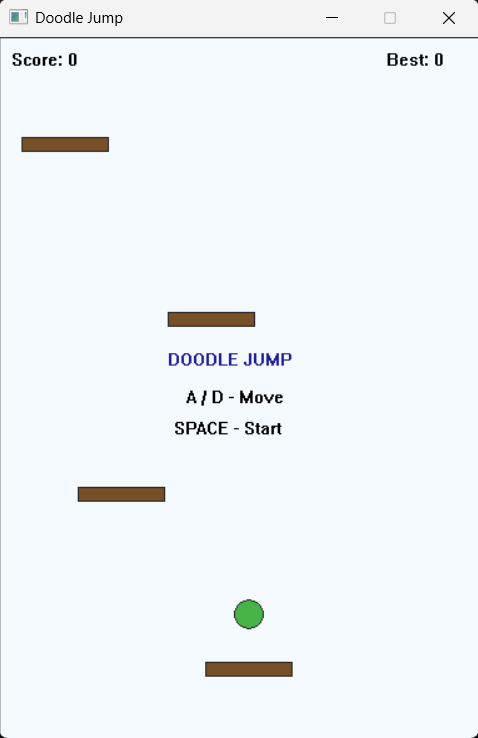
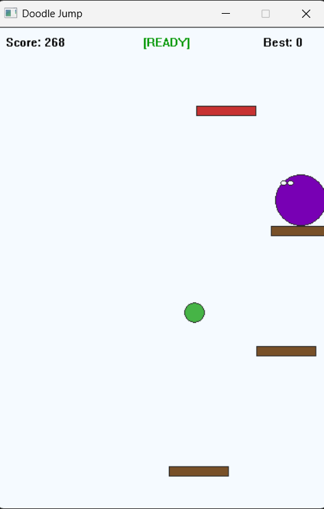
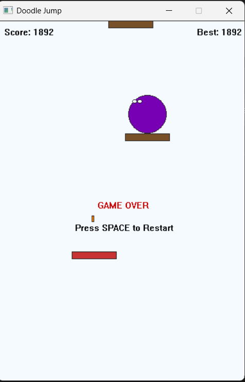

Doodlejump C + Win32API  
  
Doodlejump  - простая однопользовательская 2д игра, в которой игроку предстоит продвигаться вверх по платформам, стараясь не упасть вниз  
  
Обозначение платформ:  
Обычная (коричневая) - обыкновенная платформа, по которым игроку нужно продвигаться вверх  
Хрупкая (красная) - платформа, которая уничтожается, если игрок попадает на неё  
Платформа с пружиной (жёлтая) - платформа, которая придаёт ускорение игроку, которое в 2 раза больше, чем обыкновенный прыжок	  
Платформа с ускорителем (синяя) - платформа, которая придаёт ускорение игроку, которое в 4 раза больше, чем обыкновенный прыжок
  
Управление:  
A/D - передвижение модельки игрока вправо или влево  
Space - Старт/Перезапуск/Выстрел  
  
Очки:  
+1 за каждые 3 пикселя  
+50 за убийство врага

Модули в проекте:  
game.c - Основная логика игры  
render.c - Отрисовка элементов  
main.c - Главная функция  

Сборка для GCC:  
Из VScode:  
1. Открыть папку проекта  
2. Поставить расширение C/C++ (от Microsoft)
3. Нажать ctrl+Shift+B

Вручную из консоли:  
1.  
git clone <URL_ВАШЕГО_РЕПОЗИТОРИЯ>  
cd <ИМЯ_ПАПКИ_ПРОЕКТА>  
2.  
gcc -std=c11 -O2 -Wall -Wextra main.c game.c render.c -o DoodleJump.exe -lgdi32 -luser32  
3.  
.\DoodleJump.exe  
  
Скриншоты:  

  

